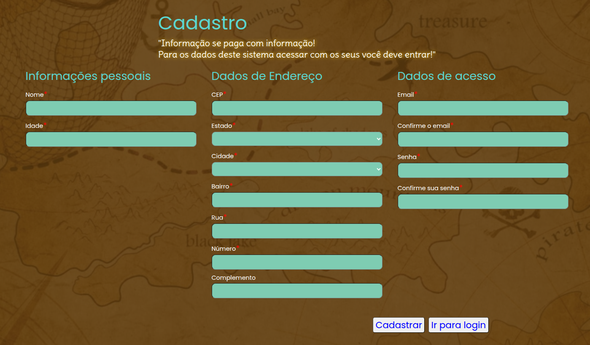
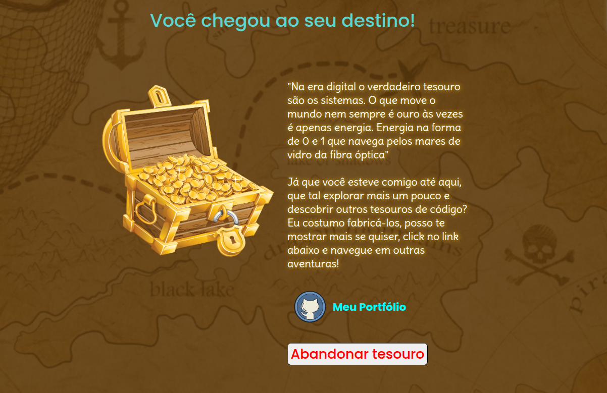

<h1 align="center" style="font-weight: bold;">Gold Form 💻</h1>

<p>Autor: Inácio Souza Rocha</p>

[](https://www.linkedin.com/in/inacio-souza/)


<h2>Sobre o projeto</h2>
Projeto de formulários orientado a template e reativo em Angular;

As interfaces foram estilizadas no estilo de caça ao tesouro, para tornar as coisas um pouco mais divertidas;

Na página de cadastro de usuário foi adicionada a busca de endereço por CEP consumindo a API de localidades do IBGE;

No back-end, o Spring Security foi utilizado ativamente para implementar a autenticação do usuário e configurar as políticas de CORS.

Contém as páginas:
- Login
- Cadastro
- Dashboard


## Tecnologias
1. `Back-end`:
    + Java 17
    + Spring Boot 3.4.3
    + Maven
    + PostgreSQL

2. `Front-end`:
    + Angular 16

<h2 id="started">🚀 Como rodar</h2>

### Pré-requisitos:
Ter os progrmas abaixo previamente instalados e configurados na sua máquina.
- `NodeJS`
- `Angular`
- `java`
- `maven`
- `postgres`
- `git`

**OBS:** Opcionalmente você pode utilizar uma imagem Docker do Postgres para evitar o trabalho instalar o banco de dados

### Clonando o projeto

  <p>Abra o terminal em um diretório de sua preferência e cole:</p>

  ```bash
  git clone https://github.com/InacioSouza/Gold-Form.git
  ```

### Executando servidor Spring
<p>Na pasta back execute:</p>

```bash
mvn spring-boot:run
```

### Instalando as dependências Angular
  <p>Na pasta front do projeto execute</p>

  ```bash
  npm install
  ```
### Rodando aplicação Angular
<p>Ainda em front execute:</p>

```bash
  ng serve -o
  ```
<p>O navegador será aberto no endereço `http://localhost:4200/` </p>

A interface será renderizada na sua tela, você poderá navegar pelas páginas abaixo:

#### Página cadastro de usuário



#### Página de login


### Dashboard




